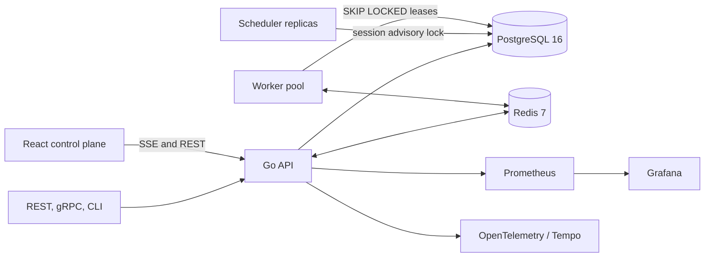

# Forge

[](https://github.com/connorg45/forge/actions/workflows/ci.yml)
[](https://github.com/connorg45/forge/actions/workflows/codeql.yml)
[](https://go.dev/)
[](LICENSE)

Forge is a distributed job queue and cron scheduler built with Go, PostgreSQL, Redis, gRPC, React, and TypeScript. It demonstrates the systems work behind reliable background execution: transactional enqueue, concurrent leasing, retries with jitter, dead-letter recovery, recurring schedules, observability, and tested crash behavior.

Run the local Docker stack for the API, workers, scheduler, PostgreSQL, Redis, Prometheus, Grafana, OpenTelemetry pipeline, and live control plane.

## Engineering highlights

- Durable PostgreSQL queue with `SELECT ... FOR UPDATE SKIP LOCKED` and timestamp leases.
- At-least-once delivery with tenant-scoped idempotency keys and idempotent handler guidance.
- Session-pinned PostgreSQL advisory locking for safe scheduler leadership.
- Lease expiry recovery that closes abandoned run history before retrying work.
- Capped exponential backoff with jitter, dead-letter inspection, and requeue without erasing attempt history.
- REST, gRPC, CLI, and server-sent-event interfaces plus a responsive React operations dashboard.
- Prometheus metrics, Grafana dashboards, structured logs, Redis-backed live stats, and OpenTelemetry traces.
- Race-enabled Go tests, TypeScript production builds, Docker builds, CodeQL, Dependabot, and migration drift checks in CI.

## Architecture



PostgreSQL is the correctness boundary. Redis accelerates pub/sub and recent metrics, but losing Redis cannot lose an acknowledged job. See [Architecture](docs/ARCHITECTURE.md) for state transitions and design tradeoffs.

## Quickstart

Requirements: Docker with Compose. The quickstart is a local development environment; its published ports are bound to loopback.

```bash
git clone https://github.com/connorg45/forge.git
cd forge
make demo
```

Open the dashboard at `http://localhost:5173`, the API at `http://localhost:8080`, and Grafana at `http://localhost:3000`.

```bash
make seed
curl http://localhost:8080/readyz
curl http://localhost:8080/v1/jobs?limit=10
```

## Interfaces

```bash
# Submit a job
go run ./cmd/forge-cli submit --handler echo --payload '{"message":"hello"}'

# Create and operate a recurring schedule
go run ./cmd/forge-cli schedule create --name heartbeat --cron '*/5 * * * *' --handler echo
go run ./cmd/forge-cli schedules
go run ./cmd/forge-cli schedule pause <schedule-id>

# Inspect and recover dead work
go run ./cmd/forge-cli dlq
go run ./cmd/forge-cli dlq requeue <job-id>
```

The full REST contract and examples are in [API](docs/API.md).

## Benchmark and failure testing

The repository includes a k6 enqueue workload and a worker-termination exercise. Results are intentionally not committed as product claims: throughput and recovery behavior depend on hardware, Docker resources, PostgreSQL configuration, payload size, and worker count.

```bash
make bench
make chaos
make verify
```

See [Benchmarks](docs/BENCHMARKS.md) for methodology and [Operations](docs/OPERATIONS.md) for recovery expectations.

## Security boundary and limitations

Forge does not implement application-level authentication or tenant authorization. `tenant_id` is a caller-provided namespace for idempotency and metrics, not an access-control boundary. Keep the API, gRPC endpoint, data stores, and observability services on trusted networks, and place authenticated TLS termination in front of any non-local deployment. Configure `CORS_ALLOWED_ORIGINS` with exact trusted dashboard origins; cross-origin browser access is disabled by default.

The included handlers (`echo`, `sleep`, `fail`, and the test-only chaos handler) demonstrate queue mechanics rather than a plugin sandbox. Production integrations should register controlled handlers in code and validate their payloads.

## Correctness model

Forge provides at-least-once execution. Enqueue idempotency is enforced by a unique `(tenant_id, idempotency_key)` constraint. A worker can perform a side effect and crash before acknowledgement, so handlers must make external effects idempotent. This is the honest boundary: no queue can prove exactly one external effect across an arbitrary crash without an idempotent record or transaction shared with that effect.

## Repository map

- `cmd/`: API, worker, scheduler, and CLI entry points.
- `internal/queue/`: transactional queue and state transitions.
- `internal/scheduler/`: cron evaluation, leadership, and schedule storage.
- `internal/worker/`: concurrency, heartbeat, shutdown, and handler registry.
- `internal/api/`, `internal/grpcsvc/`: public interfaces and live events.
- `web/`: React and TypeScript operations dashboard.
- `deploy/`: Docker Compose, images, Prometheus, Grafana, and Tempo.
- `test/integration/`: queue, worker, and chaos tests with Testcontainers.

## Documentation

- [Architecture](docs/ARCHITECTURE.md)
- [API](docs/API.md)
- [Operations](docs/OPERATIONS.md)
- [Benchmarks](docs/BENCHMARKS.md)
- [Contributing](CONTRIBUTING.md)
- [Security](SECURITY.md)

Licensed under the [MIT License](LICENSE).
