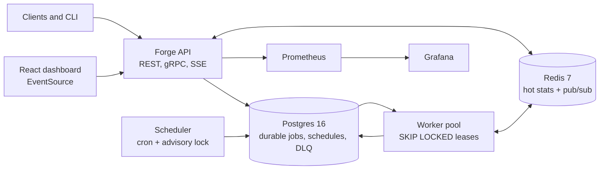

# Forge

Forge is a self-hostable distributed job queue and cron scheduler for teams that want durable Postgres-backed jobs, simple operations, and a live React control plane without taking on a broker fleet. On an Apple M4 with 16 GB RAM, Forge enqueued **2,091.20 jobs/sec across 2 workers with p99 enqueue latency of 45.34 ms**, and the chaos run completed **10,000/10,000 jobs with zero dead-letter rows** while SIGKILLing workers every 5 seconds for 60 seconds.

## Architecture



## Quickstart

```bash
git clone https://github.com/connorg45/forge.git
cd forge
docker compose -f deploy/docker-compose.yml up --build
```

Dashboard: http://localhost:5173. API health: http://localhost:8080/healthz. Grafana: http://localhost:3000.

## Benchmark

`make bench` uses k6 against `POST /v1/jobs` with 32 VUs for 20 seconds.

| workers | throughput (jobs/sec) | p50 | p95 | p99 | hardware |
|---:|---:|---:|---:|---:|---|
| 2 | 2,091.20 | 13.49 ms | 29.02 ms | 45.34 ms | Apple M4, 16 GB RAM, Docker Desktop |

## Failure Modes

| failure mode | behavior | guarantee | recovery time |
|---|---|---|---|
| API crashes mid-enqueue | The Postgres transaction either commits a job row or commits nothing. A client retry with the same idempotency key returns the existing row. | No acknowledged job is lost; duplicate submits collapse per `(tenant_id, idempotency_key)`. | Client retry latency plus API restart. |
| Worker `kill -9` mid-job | The job remains `running` until `locked_until`; later dequeue calls reclaim the expired lease and retry it. | At-least-once execution; idempotent handlers prevent duplicate side effects. | Lease duration, default 5-10 seconds in compose. |
| Postgres restarts | In-flight SQL fails and processes reconnect. Committed jobs, runs, schedules, and DLQ rows remain durable. | Durable committed state survives; unacked running jobs retry after lease expiry. | Postgres restart plus lease expiry. |
| Network partition worker↔DB | Heartbeats and acks fail; the worker cannot extend the lease, so another worker can reclaim the job. | No job disappears; side effects must be idempotent because a partitioned worker may have done work before losing DB access. | Lease expiry after connectivity loss. |
| Scheduler crashes | The advisory lock is released with the DB session. A restarted scheduler or another replica polls due schedules and enqueues with schedule-run idempotency keys. | Due schedules are not double-enqueued for the same run timestamp. | Next scheduler poll, default 1 second. |

## Exactly-Once Semantics

Forge implements exactly-once *effects* as at-least-once delivery plus idempotency keys, not magical true exactly-once execution. Enqueue idempotency is enforced by `UNIQUE (tenant_id, idempotency_key)`, and job handlers are expected to make their side effects idempotent, as the chaos handler does with `INSERT ... ON CONFLICT DO NOTHING` keyed by `job_id`. True exactly-once across a queue, worker process, database, and external side effect is impossible in the general case: after a worker performs the side effect but crashes before acking, no observer can perfectly know whether the work happened without consulting an idempotent external record. That is the practical Two Generals / FLP intuition: unreliable communication and crash timing prevent a universal, coordination-free proof of exactly one outcome.

## Why Postgres Over Redis Streams / Kafka

Postgres is the right default for Forge because the queue needs durable jobs, schedules, idempotency keys, dead-letter rows, run history, and transactional state transitions. Keeping those in one relational system means `SELECT ... FOR UPDATE SKIP LOCKED`, DLQ insertion, retry state, and scheduler bookkeeping can all share the same consistency model and backup story.

Redis Streams are excellent for hot ephemeral pipelines, and Forge still uses Redis where it shines: pub/sub and recent stats. But if Redis Streams hold the durable queue, most production systems eventually add a relational store beside them for idempotency, schedule definitions, audit history, and operator inspection. Forge starts with that durable store instead of splitting correctness across two places.

Kafka is the better tool when the workload is a high-throughput event log or when many consumers need replay. It also brings partitions, consumer groups, retention policy, schema governance, and more operational surface area than many self-hosted job queues need. A tuned Postgres queue can carry a lot of product traffic; once a deployment needs roughly **50k jobs/sec** sustained enqueue/dequeue throughput, Kafka or another log-oriented system becomes the honest next architecture.

## Goals & Non-Goals

Goals:

- Durable Postgres-backed jobs with `SKIP LOCKED` dequeue leases.
- Honest at-least-once processing with idempotency-key deduplication.
- Demoable local stack with API, workers, scheduler, dashboard, Prometheus, Grafana, Redis, and Postgres.
- SSE-driven operations dashboard with no polling loop.
- Failure behavior that can be tested with worker `kill -9`.

Non-goals:

- Global ordering across queues or tenants.
- True distributed exactly-once execution without idempotent side effects.
- Replacing Kafka for event-log workloads above the Postgres throughput ceiling.
- Multi-region consensus or cross-database replication.

## Demo GIF


Record this after the first deployed demo so the GIF reflects the real hosted dashboard.

Live demo: https://example.com/forge-demo-placeholder
